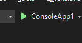
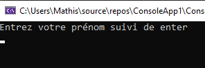
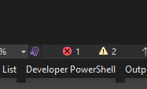
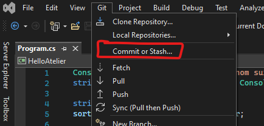
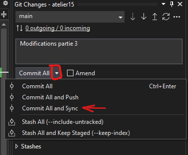

# Exercice initiation Visual Studio

## Partie 1 : Cloner le projet

1. Clonez le [dépôt de GitHub Classroom]() TODO. Au besoin, consultez [la procédure de l'atelier 13.](https://github.com/PiFou86/420-W00-SF/blob/3360bf2eb7ec4fa16ac22133f7120c864d0c4891/EXERCICES01.md) 
**Faites attention à bien utiliser le nouveau lien classroom, sinon, vous allez refaire l'ancien exercice !**
2. Ouvrez le projet dans Visual Studio 2022 en double cliquant sur le fichier "atelier15.sln".
3. Exécutez le projet à l’aide du triangle vert en haut de l’EDI (en : IDE) (voir ci-dessous).



4. Si vous voyez cette ligne se faire afficher dans la console, vous avez réussi la première partie ! (vous pouvez fermer la fenêtre de console)



## Partie 2 : Comprendre le projet

1. Que fait l’opérateur ```+=``` ? Pour le découvrir, dupliquez la ligne ci-dessous (cliquez sur la ligne à dupliquer et appuyez simultanément sur les touches [Ctrl] + [d]) et exécutez de nouveau le programme.

```csharp
sortie += nomUtilisateurEntreeUsager;
```

2. Que se passe-t-il si vous dupliquez la ligne 2 ?

Pour voir les erreurs du projet, cliquez sur le ```x``` rouge en bas à gauche de l’EDI.



Annulez vos dernières modifications avec [Ctrl] + [z] avant de continuer.

## Partie 3 : Améliorer le projet

1. Renommez la variable *nomUtilisateurEntreeUsager* en un nom plus simple (comme nomUtilisateur) à l’aide de la fonctionnalité de renommage : clic sur l’élément à renommer suivi de [Ctrl] + [r], [Ctrl] + [r].

Remarquez vous un avantage d’utiliser la fonctionnalité de renommage à la place de renommer la variable manuellement ?

Si ce n’est pas le cas, dupliquez la ligne ([Ctrl] + [d]) qui ajoute le nom d’utilisateur à la sortie plusieurs fois et renommez la variable une seconde fois.

2. Nous voulons maintenant ajouter au programme la fonctionnalité de demander le nom de famille à l’utilisateur et de l’afficher en majuscules à la fin du message.

Pour ce faire, inspirez-vous (fortement) du code présent pour demander à l’utilisateur d’entrer son nom de famille et mettez le dans une variable.

Ensuite, affichez le nom en majuscules. Il existe une méthode qui permet d’afficher une chaîne de caractères en majuscule qui s’appelle : ```maVariableQuiContientLaChaine.ToUp...()```. Pour découvrir le reste du nom de la méthode, utilisez le raccourci clavier [Ctrl] + [espace] pour faire apparaître des suggestions. Finalement, naviguez ces suggestions avec les flèches haut/bas et faites [tab] (la touche à gauche du q) pour l’insérer.

3. Poussez vos modifications sur GitHub Classroom. Pour ce faire, ouvrez le menu de "commit" de Visual studio.



Ensuite, entrez un message de commit et sélectionnez du menu déroulant l’option commit all and sync.



Finalement, allez vérifier sur github classroom que le test automatisé à réussi. Si c'est le cas, demandez accès à la prochaine section. Sinon, revenez en arrière et testez votre programme en local pour trouver l'erreure.

